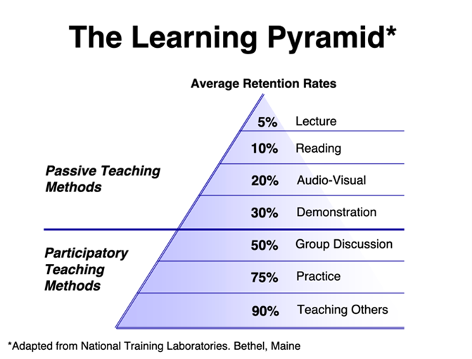

# CS 480 – Topics in Software Engineering - Syllabus

Minnesota State University, Mankato. College of Science, Engineering, & Technology.
Fall 2023, Block 2. Section 1.

> This is version 1.0 of the syllabus. Any changes will be announced in class and posted in D2L.

> This course is offered on an In-Person Only basis. In-person attendance is required for each course session.

> This is a 2-credit elective course for Computer Science majors.

## Class Time and Place

- **Semester/Block**: Fall 2023, Block 2 (10/17/2023 through 11/30/2023), 13 class sessions
- **Days**: Tuesdays and Thursdays
- **Time**: 8:00 AM – 9:50 AM
- **Location:** TE 315

## Instructor

- **Name**: Flint D. Million (he/him)
- **Email**: flint.million@mnsu.edu
- **Office Hours**: TBD

## Course Description

This course will go beyond writing, testing and debugging code by introducing you to several aspects of software development that extend beyond coding. We will cover topics including source code management and control (Git), DevOps (CI/CD), and containerization. We will also discuss the theory behind aspects of software interoperability such as APIs, versioning and cross-platform compatibility. C#, Java and Python will be used as necessary for examples, but there will be only minimal coding in this course.

The goal of this course is to fill in any gaps in your knowledge of the full Software Development Life Cycle (SDLC). 

## Prerequisites

Admission to the upper division Computer Science program is required.

This course is aimed at students who know at least two programming languages at a basic, functional level. We will use Python, Java and C# as appropriate, but we will not be focusing on writing code - the only instances where you will write actual code in "traditional" programming languages is in support of the other aspects of the SDLC that we will be covering.

> For example, one of our units will cover software versioning and API interoperability. For this unit, you will be given code for a working API and a scenario to add a new feature (along with its code) while maintaining compatibility with current users of the API. You will only need to write code to connect these pieces together.

## Requirements

You will be participating in in-class activities that require a laptop to be brought to class.  If you do not have access to a personal laptop, you can borrow one from the University Library.

D2L will be used to provide you with course announcements, homework assignments, course materials and quizzes. Official course announcements will also be sent to you via your university E-mail address. You are responsible for regularly checking D2L and your university E-mail for communications.

Some projects in this course will make use of cloud services. While we will be discussing use of commercial cloud providers such as Amazon AWS or Microsoft Azure, you will not need to use these services in this course as I will be providing you with access to a cloud server for the course. You may of course choose to use a commercial service if you wish, but you will need to be cognizant of any potential fees you may incur.

## Course Philosophy – The “Flipped Classroom”

The data on learning and classroom performance shows overwhelmingly that students learn best through group discussion, active practice of course material, and teaching others what they’re learning. Additionally, lectures are the least effective way to get material across to students.  Therefore, this class will not include lectures. Instead, to make the most of your total time budget for this course – 80 hours total during the semester, including your time in the classroom – we will run this course using the “Flipped Classroom” model.

The basic idea of this approach is that you read, watch, and/or study course material before you come to class. We then spend class time working actively with the material in ways that will help you truly understand it deeply, so that you can retain and use the information permanently. 
Class Preparation for the Flipped Classroom

You must complete your Class Preparation work before coming to class!

Before each class, you should spend significant time doing the following:

1. Read and study the material listed in the Course Calendar (see D2L) for the specific course meeting. Material will include online resources (e.g., Microsoft documentation), materials produced by myself, and additional Internet resources.
2. Engage with the homework to try out new concepts on your own. It is advantageous for you to try out the homework before class so you can get assistance during class!
3. If assigned a short presentation topic, prepare your materials and submit your short presentation materials to D2L no later than 8 AM on the morning of your assigned presentation date. Be ready to present your material in class when called upon.

During our scheduled classroom time, we will engage actively with the material, utilizing activities including:

- Students making individual short presentations on assigned topics
- Group discussions about the content
- Small team sessions focused on solving specific technical exercises and programming problems directly related to the homework
- Short content reviews led by the instructor

The main benefits of taking this “Flipped Classroom” approach are:

1. As a student, you get a significant amount of personal attention from the instructor
2. As the instructor, I have clear insight into how you personally are doing with the course material, so that I do my best to help you
3. You, as a student, learn much more overall, and absorb what you learn much more deeply and permanently
4. It’s a much more efficient use of your 80 hours for the course
5. It’s much more fun than sitting in lectures and then struggling on your own with homework!

## Individually Assigned Short Presentations

For each class session (not including the first one), a few students (typically three or four) will be assigned one specific presentation topic each on a narrow topic related to the week’s main topic of discussion. When you are assigned a topic, you should prepare a short (5-10 minute) presentation that covers the basics of the assigned topic. You will produce a PowerPoint or similar presentation with a few slides – no need to go beyond 3 or 4 slides maximum. Materials related to each topic will be provided for you to study on D2L, and you are also free to use other resources in your study. If you do utilize other sources, please include references in your presentation – this will also help your fellow classmates with additional resources to aid their study!

Individual presentation assignments will be posted on D2L and via E-mail with the greatest possible advance notice.

The rubric for scoring these presentations is as follows:

- Correct coverage of topic material: **60%**
- Clarity of spoken presentation: **25%**
- Quality of presentation slides: **15%**

## Grading

This course is available on a for-credit, Grade Only basis. You will receive a letter grade in this course. Your final grade will be calculated according to the following rubric on the next page.

Students have the right to ask an instructor for an explanation of any grade received. Grade appeals are reviewed in instances where students perceive that a final course grade is unfair, arbitrary, or capricious. Students must begin the procedures of this policy within two weeks of university notification of a final course grade. Students needing assistance at any step in appealing a grade may contact the Academic Affairs Coordinator of the Student Senate (280 Centennial Student Union; phone 389-2611). Students should retain copies of all materials associated with this process for their records. Students should also have records of their coursework from the class as part of the appeal process. The full policy is available at http://www.mnsu.edu/policies/approved/gradeappeals.pdf.

