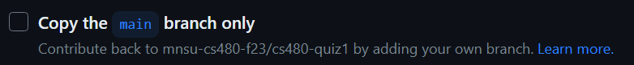

# Quiz 1 - CS 480, Fall 2023, Block 2

**The quiz repository is [here](https://github.com/mnsu-cs480-f23/cs480-quiz1).** (https://github.com/mnsu-cs480-f23/cs480-quiz1)

This project will serve as your first of two *quizzes* for the project. This is a take-home quiz that you may do on your own time. **You are to work INDIVIDUALLY on the quiz - you may NOT work with others or in your groups!** You may **NOT** ask others in class for help on the quiz. However, you **MAY** use Internet resources as reference as long as those Internet resources do not include "asking other members of the class via the Internet" or "copying and pasting stuff as-is"!

This quiz is due **before class** (at 8 AM) on Tuesday November 14th. Points will be deducted for late quiz completion.

**You may E-mail me if you are having functional or technical issues with the quiz activities. I will NOT answer questions specifically related to the knowledge you need for the quiz but I am happy to help you if you are experiencing unexpected or unusual errors that are preventing you from proceeding. Please E-mail me at flint.million@mnsu.edu if you need help.** ***Do not wait until the last minute!***

## Steps

1. **Fork** the repository `cs480-quiz1` into the *organization* (**not** to your personal GitHub) and name it `cs480-quiz1-firstname-lastname` (replacing `firstname` and `lastname` with your name). This repository contains a skeleton REST API very similar to Phase 1 of our API exercise. Place the form within the CS480 course organization and make sure it is marked private.

    > Make sure that you **uncheck** the following checkbox, so that you will get a copy of all branches on the original repository in your fork. If you do not uncheck this box, you will not have the `main-hotfix-1` and `bug` branches that you will need for later steps in this quiz!
    >
    > 
    >
    > If you already forked the repository and don't have the extra branches, see the [section on how to fix this](#fixing-a-fork-made-with-only-the-main-branch) later in the quiz.

2. Clone your fork to your machine, setup the appropriate Python virtual environment and install the requirements.

    > **Reminder:**
    >
    > To create a Python virtual environment: `python -m virtualenv venv` followed by the appropriate activate script:
    >
    > Windows cmd.exe: `venv\Scripts\activate.bat`
    > PowerShell: `. .\venv\Scripts\activate.ps1`
    > Linux/Mac: `source venv/bin/activate`
    >
    > You should have `virtualenv` installed from the API project, but if not: `python -m pip install virtualenv`
    >
    > To install the requirements, after activating the virtual environment (you should see `(venv)` on your command prompt): `pip install -r requirements.txt`

    A fun surprise for this quiz: you'll be using a *different* framework. We're going to take a look at another framework that is excellent for building Web APIs known as [FastAPI](https://fastapi.tiangolo.com/). Don't worry, you still won't have to do any code, and in fact this framework has some really neat features that will make things a bit easier than originally planned!

    > Note: You run this API the same way we ran the Flask API: `python api.py`. It will run on port 5000 - if you had issues with that before, make sure you address those. Or, you could change the port number in the `main` method of the code... :D

3. Create a **branch** titled `quiz1`.
4. Add the following method to the API:

        # Define your own REST endpoint for this method following the REST philosophy
        # Note: FastAPI uses curly-braces { and } for parameters in the path, and the 
        #   string between the braces must be the same as the parameter to the function 
        #   being called, e.g. "/object/{id}" for a method def myMethod(id)
        # This is DIFFERENT from Flask, which uses angle-brackets (less-than and greater-than
        # signs)!
        @app.put("PUT_YOUR_ENDPOINT_PATH_HERE!",
                responses={
                    201: {"description":"The book was successfully added to the database"},
                    400: {"model":str,"description":"The book ID you provided already exists in the database - try a POST request"}
                },
                status_code=status.HTTP_201_CREATED)
        def put_book(id: str = Path(description="ID of new book"), data: Book):
            """Adds a new book to the database."""

            # If book already exists, bad request
            if id in bookList.keys():
                raise HTTPException(status_code=400)

            bookList[id] = data
            return Response(status_code=status.HTTP_201_CREATED)

5. Now the fun part. You don't need Postman anymore! Try running the API and going to `http://localhost:5000/docs`. You should see your new API method reflected there, along with an interface to test the method!
   
    Once it works, commit and push your change. Take a screenshot of your API documentation view showing a successful run of your new method. Call the screenshot `step5` and add it to your branch.

    > Note: One of the cool things about FastAPI is you do not need to quit and restart the application - just make your changes to the `api.py` file and save them, and FastAPI will auto-refresh the application in real time!
    >
    > You may still have to restart the application if something you added causes the program to crash, however.

6. While still on your own branch, make a *new* branch called `quiz1-feature1`.
7. Add the following method to the API:

        @app.post("PUT_YOUR_ENDPOINT_PATH_HERE!",
                response_model=None,
                responses={
                    201: {"description":"The book was successfully added to the database","content":None},
                    400: {"description":"The book ID you provided already exists in the database - try a POST request","content":None}
                },
                status_code=status.HTTP_202_ACCEPTED)
        def update_book(id: str = Path(description="ID of book to update"), data: Book):
            """Updates an existing book in the database."""

            # If book already exists, bad request
            if id in bookList.keys():
                raise HTTPException(status_code=400)

            bookList[id] = data
            return Response(status_code=status.HTTP_202_ACCEPTED)

8. Test the API again to make sure the new method works. Add a screenshot called `step8` showing your API working and add it to your branch.
9.  Commit and push your change.
10. Now, *check out* your `quiz1` branch.
11. Create **another** new branch titled `quiz1-feature2`.
12. Add the following method to the API:

        # *Gotcha*: Note that the function parameter name is "name", not "id" this time!
        # Make sure you account for that in your endpoint name.
        # Hint: {name} instead of {id}...
        @app.get('PUT_YOUR_ENDPOINT_PATH_HERE!',
                responses={
                    200: {"model":list[BookWithId],"description":"A list of all books in the given series. May be an empty list if the series does not exist."}
                })
        def get_series_books(name: str = Path(description="Name of series to retrieve")) -> list[BookWithId]:
            """Gets all books in the library that are part of a requested series."""

            # This is some Python "magic" to filter and rebuild the dictionary of books in one go.
            return [dict(bookList[item], **{"id":item}) for item in bookList.keys() if bookList[item]['series'] == name]

13. Test the API again to make sure the new method works. Add a screenshot called `step13` showing your API working and add it to your branch.
14. Commit and push your change
15. Now, check out `quiz1` again.
16. **Merge** both of your feature branches into this branch.

    > You will likely get merge conflicts &ndash; you'll have to resolve them!

17. Push your changes. (You might need to first commit a marge conflict resolution!)
18. Now, merge in the existing branch `main-hotfix-1` to your `quiz1` branch. If you get merge conflicts - resolve them!
19. Test the API again! Make multiple screenshots showing all of your API endpoints that you added working. Name your screenshots `step19-nn` replacing `nn` with incrementing numbers as necessary.
20. Check out the `bug` branch. There's something wrong here... (Try running the API.)
21. Use `git bisect` to figure out both the *commit ID* and the *author* of the commit that caused the bug.

    > Hint: This won't be as simple as our in-class exercise - there's no obvious way to automate the bisect process. You can either do it manually or *discover a creative way* to automate it. (There is a way...)
    >
    > Manually reviewing the file will be really hard... the "manual" way is to simply try running the API at each bisection. If the API runs, it's good; if you get a crash right out of the gate, it's bad.

22. Switch back to your `quiz1` branch. (You don't need to *fix* the bug, just find the commit and author where it was introduced.)
23. Add a file to your branch called `blame.txt`, in which you post the commit ID and who created the commit that introduced the bug.
24. Push this change to Git.
25. Submit the link to your repository to the D2L dropbox.

## Requirements

* **Use informative commit messages!** Messages like "fix" or "change" are insufficient. Do your best to come up with a reasonable description of the change you made for each commit!
* Your API should be *functional* in the final commit on your `quiz1` branch! Test your API endpoints thoroughly!
  * If you *really* like Postman you can still use it. The only requirement is that you submit screenshots showing your API functioning properly in whatever way you choose.
* Your screenshots can be in any standard image format such as PNG or JPEG.

## Deliverable

Your final submission should be a *Git repository that is part of the organization* which contains the following components:

* A `quiz1` branch with commits for:
  * one new API endpoint and evidence of test
  * merge commits for `quiz1-feature1` and `quiz1-feature2` if merge conflicts occurred
  * merge commit for merging `main-hotfix-1` if merge conflicts occurred
  * commit containing `blame.txt` indicating who to "blame" for the broken code on `bug`
  * The final commit on `quiz1` should include five working REST endpoints.
* `quiz1-feature1` and `quiz1-feature2` branches containing *separate* API endpoints added and tested with screenshots of the testing process

If you are confused or unsure of any requirements please feel free to E-mail me and I will clarify.

## Grading Rubric 

&nbsp; | 0 | 1 | 2 | 3 | 4 | 5 | Percentage of grade
-|---|---|---|---|---|---|-
**Basic Git Operations** | No branch made; no commits made | Branch made but no other commits made | &nbsp; | Branch made and commits made with poor or inadequare commit messages; commits are missing | &nbsp; | Branch made and all commits made with proper commit messages | 15%
**Merge conflicts** | No attempt made to resolve merge conflicts | Merge conflicts left in repository (e.g. committed with `>>>>>` indicators and no attempt to resolve) | Evidence of some attempts to resolve merge conflicts but not all conflicts resolved (e.g. some `>>>>>` indicators remaining in code) | Merges resolved as appropriate but with missing or inappropriate merge commit messages; API not functional after merge resolutions | Merges resolve appropriately and API is functional, but proper commit messages not used | Merges successfully resolved; appropriate commit messages used; API continues to function as expected after merges | 20%
**API Operations** | No attempt made to introduce new endpoints to API | New endpoints introduced with significant breaking bugs | New endpoints copy/pasted from quiz verbatim | New endpoints copy/pasted from quiz with only very minimal changes made | New endpoints functional with appropriate decorator and endpoint names following REST principles | New endpoints functiona, with appropriate endpoint names following REST principles, screenshots of Postman demonstrating working API included | 35%
**Bisecting** | No attempt made to identify breaking commit | Incorrect or "guessed" commit and author given | &nbsp; | Correct commit author **or** commit ID given in `blame.txt` file | &nbsp; | Correct commit author **and** commit ID given in `blame.txt` file | 10%
**Punctuality** | Quiz not submitted after 3 days past due date | Quiz completed significantly late (more than 1 day) or in a way that cannot be graded by the instructor (you need to fix that ASAP if so!) | &nbsp; | Quiz completed late less than 1 day | Quiz completed late less than 12 hours | Quiz completed on time! | 20%

This quiz will be worth 7.5% of your total grade.

Good luck!

## Fixing a fork made with only the `main` branch

If you have already forked the repository, you can use these commands in your repository directory to resolve it without having to start over or re-fork:

    git remote add upstream git@github.com:mnsu-cs480-f23/cs480-quiz1.git
    git fetch upstream
    git switch -c main-hotfix-1 upstream/main-hotfix-1
    git branch -u origin/main-hotfix-1
    git switch -c main-hotfix-1 upstream/bug
    git branch -u origin/bug
    git checkout main
    git remote rm upstream

1.	The first command adds a second “remote” to your repository which points to the original repository and names it “upstream”.
2.	The fetch command tells Git to download the contents of the new remote we just added.
3.	The next two commands create a new local branch called “main-hotfix-1” and set that branch to “track” the contents of the main-hotfix-1 branch on the “upstream” remote – that is, it will pull in the contents of the branch on the original repository that you forked from. It then sets the new branch you just checked out to point to your own instance of the repository (“origin” is the default name of the remote when you clone a repository).
4.	The next two commands do the same for the “bug” branch which you will need later.
5.	Finally you switch back to your main branch, and delete the “upstream” remote so you won’t accidentally try to push to it later.

If you experience any issues pushing, you can use this command to force everything to go to your own copy:

    git push -u origin –all
