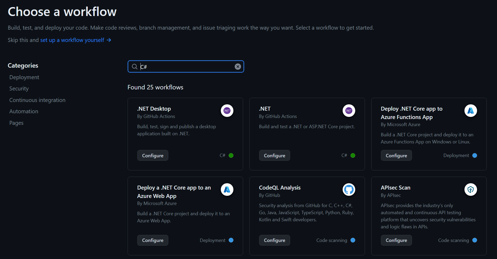
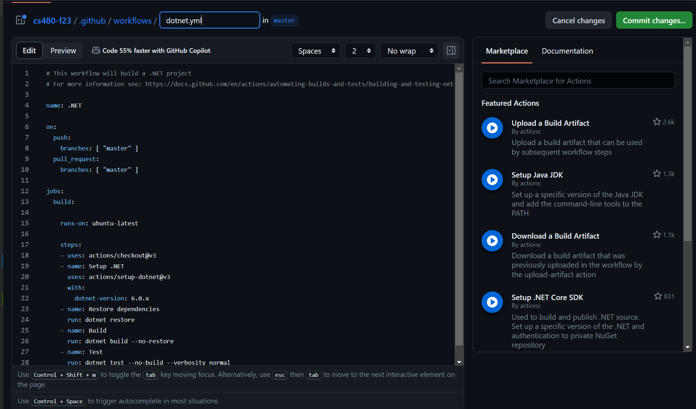

# Week 5: DevOps II and Containerization I

## Presentations

### Tuesday

* [GitHub Actions - Building A Workflow - Part 1](#discussion-github-actions---building-a-workflow---part-1)
* [Containerization - Fundamentals](#discussion-containerization-fundamentals)

### Thursday

* [Containerization - Docker, Kubernetes, and Cloud Hosting](#discussion-docker-kubernetes-and-cloud-hosting)
* [Containerization - Dockerfiles](#discussion-dockerfiles)

## Discussion: GitHub Actions - Building A Workflow - Part 1

By now you have run a very simple workflow that simply runs a few shell commands (which echo static strings). Now, it's time to actually *do* something with our workflows!

The idea of writing a new workflow from scratch might seem a bit daunting. GitHub to the rescue - there are a series of *starter workflows* written by GitHub that you can simply alter as a starting point for your particular project!

There are hundreds of workflows that have been created and curated for you as starting points for everything from compiling a C# .NET application to deploying some Markdown pages to a web site. 

> By the way, did you know that there's a GitHub action in play for this very course website? Try visiting https://fmillion-mnsu.github.io/cs480-f23 - you'll see the same content you see on the Github, but on "plain" web pages. How is this accomplished? By a GitHub Action, of course! 

When you're ready to add a new action to a GitHub repository, you can simply visit the "Actions" tab in your repository and choose the "New Action" button. You'll then be presented with a series of workflows which are recommended for your repository based on its content. However, you can simply search the starter workflows by using the search box if none of the workflows on the page apply to you. Once you choose an action, you'll be given a Web-based editor that you can use to edit your action's commands. 

For example, let's imagine we want to build a C# .NET application. We would also like to run any tests if applicable, and we want Actions to automatically handle any dependencies our program has. When we go to add a new action, we can simply search for `C#` and we'll be presented with a plethora of possible actions:

Some of these actions are related to commercial or paid services that you can implement into your workflows, and the list will go on for quite some time, offering a variety of workflows related to a variety of services. If you look under the author section (e.g. "By GitHub Actions") you can generally identify which actions are geared for general use and those which are geared for use on a specific platform. (For example, actions by "Microsoft" are for deploying your software to Azure, while "GitHub Actions" actions are for simply building or testing your .NET application with the built-in tooling.)

Once an action is selected, you'll be immediately placed into GitHub's web editor, where you can setup your workflow.

There is a [very lengthy and complete page on GitHub](https://docs.github.com/en/actions/using-workflows/workflow-syntax-for-github-actions) that explains the detailed syntax and all of the options available for writing a GitHub action workflow. We're not going to go into extreme detail, but you will soon be writing your own GitHub workflows! Let's get started...

### The `on` parameter and events

We've seen it before, but we haven't yet learned how to use it - the `on` parameter in a GitHub Actions workflow lets us specify exactly when a workflow should run.  The `on` parameter specifies which **events** will trigger GitHub to schedule the workflow for execution.

**Events** are any number of things that can happen in your Git repository with respect to GitHub. [This page on Microsoft](https://docs.github.com/en/actions/using-workflows/events-that-trigger-workflows) lists the details of events and gives a snippet of example code for each of the various types of events. (In your presentation you can cover the obvious `push` event as well as at least a couple other events of your choosing.) 

### `jobs`

A *job* is a set of steps in a workflow. Jobs act as a complete atomic unit, and a failure of one job can be set to abort the entire workflow (which would usually be the case). In the `jobs:` section of the file, we create a subsection for each job:

    jobs:
      job-one:
        # job goes here
      job-two:
        # job goes here
      ...

Inside of each job, we give any optional parameters that we need for that job. These parameters can include things like `runs-on`, which indicates the tags that we need the runner that runs this job to have. This is, for example, how we can ensure that a job runs only on Linux or Mac systems, or that the runner in question has some necessary software installed (we would do that via a custom tag).

Other examples of things we can include as values under a job:

* `env`: Provide environment variables that will be set for all steps running under this job. This can either be static values or include placeholders that are populated by GitHub Actions' *variables* functionality (a later discussion).
* `needs`: Specify jobs that must complete before this job runs. This is how you can set up dependencies - for example, the code must be built successfully before it can be deployed. 

    > If no `needs` parameters exist, all jobs will run *in parallel*.

* `uses`: Pulls in a workflow from another file. This can be useful for creating "template" or "reusable" workflows that are invoked from other workflows. 

    > Suppose, for example, that you manage ten projects that all have extremely similar build and deployment requirements. You could build your own template workflow and put it in its own repository, and then use the `uses` option to tell GitHub to run that workflow here instead, including any local environment settings you supply here. 

There's others that are beyond the scope of this discussion, but the reference page lists every possible item in the GitHub Actions schema.

### Steps

The last thing you do for a job is define what the job does. (Duh, right?) This is done with the `steps` section.

Each step can be given a friendly name that is displayed in the GitHub Actions run log. The simplest kind of step includes a `run` option, which simply means to run the given command on the runner. For example:

    steps:
      - name: Print something out in the log
        run: echo "Hi there, I'm printing something out in the log because reasons..."

Alternatively, each step can include the name of an *action* (get it, GitHub *action*s?). One type of action is the one we've seen already - a public repository of code organized in a certain way for GitHub Actions. The other option is a Docker container - a topic we'll be seeing a lot more of shortly! (Hint: Docker containers are actually run by using a specially written GitHub action. So technically all GitHub actions other than scripts are GitHub repositories, there's just a special one that is designed to run Docker containers.)

We will be coming back to writing GitHub actions soon, but let's take a detour and talk about the other big topic for the second half of the course - *containers*.

## Discussion: Containerization Fundamentals

We'll be coming back to DevOps soon, but for now, we're going to take a detour and start talking about Containerization. Containerization is an important tool and is directly connected with DevOps, so we'll cover Containerization for a while, then we'll loop back around and put everything together!

For this discussion, let's start with a bit of a review of *virtualization*. You have almost certainly seen virtualization at some point in your computer science studies, even if it's as simple as getting Windows to run on your Mac or getting Linux running on your Windows machine, both without rebooting. But have you thought very deeply about *what* virtualization is? This will help us understand containerization conceptually.

### History

Virtualization was originally conceived in the 1960s by IBM. At the time, mainframe computers were the state of the art, and organizations had a desire to make sure these extremely expensive machines were always being used (because often, mainframes were leased for a monthly fee in the tens of thousands of dollars, so every second the mainframe wasn't being used was literally wasted money!) Prior to virtualization we had moved from *offline* processing, where an operator physically loaded stacks of punched cards into the computer and collected the output from the printer, to online *batch processing*, where the computer could run itself as long as it had a queue of jobs ready to go.

But it was quickly realized that there was a serious bottleneck in the system: input and output. Reading data in from tape drives, while very fast, was still nowhere near as fast as the CPU could process the data. You might have had a CPU that was only being 20% utilized, simply because the tape couldn't feed data to the system fast enough. The same applied for output - the printer can only print so fast, and while it's printing the CPU can do nothing but wait!

*Virtualization* was the solution to the problem. What if we could take that CPU and make it behave as if it were many *separate* CPUs, sharing the available computing power among these virtual CPUs? Large computer shops often had multiple tape drives and multiple printers but only one CPU unit, so the obvious solution was to devise a way to get *multiple* tape drives and printers working simultaneously. The classic designs had no way to do this, so *virtualization* was conceived - a way to make one CPU appear, logically, to be multiple *virtual* CPUs! 

(This technique eventually led to *online interactive computing* - what was once commonly known as "time-sharing systems" - where multiple users could log on to the system with an interactive terminal, and each user could run applications and processing jobs independently of anyone else. To this very day, this framework and technique lives on in every modern Linux system!)

### Virtualization versus containerization

Let's get this out of the way up front: Containerization is a *type of virtualization*. There are obvious differences in the practical implementation of each type of system, but conceptually the only difference between containerization and "classical" virtualization is *what exactly is virtualized*.

Let's think about *resources*. What sorts of resources does a physical hardware computer offer to the software running on it? Things such as...

* CPU computing power
* system memory
* storage devices
* I/O devices, such as keyboards, mice, display adapters, sound cards, network adapters...

...come to mind. These resources are all physical hardware - you can hold up a stick of RAM or a hard drive or SSD. These resources are what we'll refer to as *hardware resources*.

Now, think about a typical application that you might write. When you want to write some data to a file on disk, do you:

* figure out where, precisely, physically, your data will reside on disk,
* calculate the magnetic flux transitions or flash memory programming pulse levels needed to write the data
* figure out which address the storage device is accessible on via the system bus
* time the write operations properly so that the disk device isn't overwhelmed
* handle security, to make sure that nobody else you don't want accessing that file can't do so...

Or, do you:

* run a function that you provide a filename to, which gives you a handle to the file
* issue write commands to that file handle
* close the file handle, with the confidence that the data has been put on storage

Of course, most programmers today will do the second option. By now, you've studied **operating systems** - one of the OS's primary jobs is to provide services such as these for your applications. Your app doesn't need to understand magnetic flux transitions on magnetic media, it doesn't need to understand the data structures that store and organize the bytes of data on your storage media, and it doesn't need to concern itself with buffering, throttling and security. These services are all provided to you by your operating system. 

With this in mind, we can now clearly define the difference between classical virtualization and containerization:

* Classical virtualization virtualizes **hardware resources**. A virtual machine consists of a virtual processor, virtual hard drive storage, virtual memory partition and os on. Devices such as sound cards, network adapters, display adapters and the like are implemented in software. Due to this, a virtual machine is able to run an *entire operating system*. You've likely seen this done - running Windows on your Mac with Parallels is a type of virtual machine. 
* Containerization virtualizes **operating system services**. A containerization system sits between the OS and your application and intercepts requests to the OS to do things such as open files, connect to network resources and so on. The containerization layer is able to programmatically impose a virtual viewpoint for the containerized application. For example, your containerized program might request a list of files in a certain directory; the containerization framework can produce a specifically crafted results list based on its configuration. 

### Comparison Chart

Here is a nice comparison chart illustrating the differences between containerization and virtualization...

&nbsp; | Virtualization | Containerization 
-|-|-
**CPU** | Emulated. May be accelerated by hardware virtualization support | No virtualization required
**Memory** | Partitioned. Fixed amount of memory reserved. | Memory managed by OS just as with any other application
**Storage** | Emulated, often by a large file on the host system | Typically implemented as a `chroot` - a host directory appears as the container's root. Other host paths can be mounted into the container.
**Networking** | Hardware of network adapter emulated and connected to "virtual" adapter on host | Application connects directly to virtual host adapter
**Sharing between host and app** | Requires specialized drivers and tooling on both host and guest | Can be easily enabled in many ways (such as mounting a specific host directory into the container)
**Security** | Guest OS must implement security as would be done on a physical computer | Host OS can implement security policy for container
**Application support** | Any application for the installed guest OS can run as long as VM provides necessary requirements. CPU emulation can enable applications for other CPU architectures. | Only applications written for the host OS and CPU architecture can run

## Discussion: Docker, Kubernetes and Cloud Hosting

So now we know what a container is. But how do we run one? 

Before we get to that, let's first talk about the mainstream containerization platforms that are prominent today. Luckily, most modern containerization systems are cast from the same basic mold, and differ only in their feature set and scalability. 

### Software

Let's start with **Docker**. If you've heard of one containerization platform, it's almost certainly going to be Docker. Docker is arguably the most popular containerization system in use today. However, this may simply be because it's the one that is the easiest to get started with and the one that's easiest to run on your own computer. You can install Docker Desktop on your computer and start running Docker containers with only a command or two. 

Another popular platform is known as **Kubernetes**. This platform is more typically seen in *cluster configurations*. Kubernetes is the program that allows a company like Google, Facebook or LinkedIn to design a website and deploy it in such a way that it can be accessed by millions or even billions of users at the same time. Kubernetes has features for *scaling* - in this context, running multiple copies of an application and logically connecting them all together. 

(If you're interested in distributed computing, and you're not an S2, you might consider my CS 485 course for Spring, where we'll discuss Kubernetes along with many other tools that allow for these sorts of advanced deployment scenarios.)

For this course, we'll focus on **Docker**, but what's cool is that both Docker and Kubernetes are built on top of the **Open Container Initiative**, a specification authored by Docker which provides a standardized way for packaging and managing containers. This means that once you understand Docker, it will be a pretty small leap to working with Kubernetes, because both systems use the same container image format. (Docker themselves also offers **Docker Swarm**, their own take on a distributed deployment system. Docker Swarm is less common than Kubernetes, but both systems are designed for the same use cases.)

### The Cloud

You can run Docker, and even Kubernetes, on your own computer. It works on Windows, Mac and Linux systems. The vast majority of container images are Linux-based, and so on Windows and Mac a virtual machine is used to run Docker. The Docker Desktop application helps manage this for you, so you don't have to deal as directly with the virtual machine side of things. You can basically use Docker the same way on all three platforms.

> On Windows, you can also run Windows-native Docker images. This is a bit more work, and is far less popular than Linux-based container images; it's typically only used for software that has a specific unique dependency on Windows. We won't be worrying about Windows containers in this course, but they *might just appear* in CS 485...

However, running Docker images locally is of relatively limited use. One of the main uses for containers today is for deploying Internet-based applications, especially Web applications and Internet servers. Docker is used for running things like Minecraft servers, database servers, Web frontends and backends and more - namely, applications that provide services over the Internet. 

To support this, many platforms today offer the ability to host containers on servers managed by the platform. You don't need to maintain a VM, install or maintain Docker itself or deal with security of the virtual machine and network. Instead, you can simply provide the name of a Docker container image and the provider will take care of hosting it for you!

We'll do a small exercise in class today where you'll run a simple Wiki container on a cloud service for free.

### Docker

The star of the show is, of course, **Docker**. Docker 

## Discussion: Dockerfiles

By now you've seen how we can run a container with Docker. The next step in your containerization adventure is how you can make your *own* containers!

The 