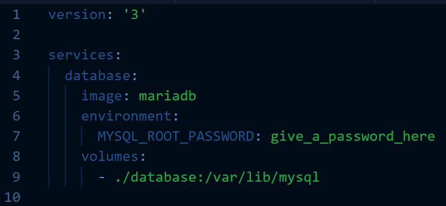

# Week 6 Assignment

Only one submission required per group.

In this exercise you will set up your own WordPress blog *on your own computer* thanks to Docker!

We will go over this in class to explain the details of the Docker Compose file sections.

Work together as a group on one machine on which Docker is working to do the following steps:

1. Create a directory on your computer to store all of the data
2. Start by creating a Docker Compose file named `docker-compose.yml` containing the following:

    
    
3. Start up *only* your database server container:

    `docker compose up -d database`

4. If you do not get any errors, your database server is up and running! 
5. Now you'll create a user in the database for your WordPress server. Run this command to get a MySQL prompt within your container:

    `docker compose exec database mysql -u root -p`

    Enter the password you provided as the value of `MYSQL_ROOT_PASSWORD` when prompted.

6. Execute the following database commands at the prompt one by one:

        CREATE DATABASE wp;
        CREATE USER 'wp'@'%' IDENTIFIED BY 'some_password';
        GRANT ALL PRIVILEGES ON wp.* TO 'wp'@'%';

7. You should now have a database for your site. Test this by running `SHOW DATABASES` to make sure it shows up.
8. Type `quit` to leave the MySQL prompt and you will be back at your normal command prompt.
9. Now, *add* the WordPress service to your Docker Compose file:

    

10. You should now be able to bring up your new container. You can take a shortcut by just running:

    `docker compose up -d`

11. Wait a few seconds to make sure everything starts up. If everything went well you should be able to visit <http://localhost:8000> to view your new blog!
12. Do something on the WordPress site of your choosing. Add a post, download and install a theme, create a page, etc. 

## Submission

You will submit these two items to D2L:

* Your Docker Compose file
* At least one screenshot (more allowed) of your running WordPress site. What you screenshot is up to you, but it should be unique enough to show that you are working on your own site!

Due date: before class on Tuesday, November 28th.

